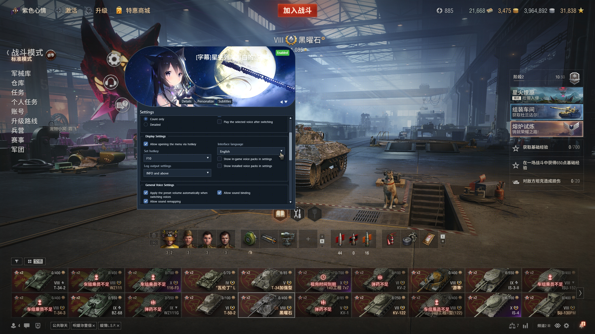

# World of Tanks Voiceover Management Plugin

**Language:** [English](README.en.md) | [简体中文](README.md)

This is an extension plugin for voice packs (voice-overs) in World of Tanks. It mainly does two things:
First, it reads the voice-overs built into the game and makes them usable; Second, it provides a loading
mechanism for community-made voice packs, while also offering extra sound-modification features and
supporting subtitle rendering.
At present, the L10N only covers Chinese and machine-translated English. If anyone would like to
contribute a translation, please contact me — I would be very grateful.

**Deployment:** Place the .wotmod file in the following path: `<World of Tanks install directory>/mods/<current version>/`.

**Files:** At runtime, files are generated/copied to `<World of Tanks install directory>/mods/configs/autoConfigVoiceOver/`.

**Requirements:** The [ModsList](https://github.com/wot-public-mods/mods-list) mod is recommended — it
adds a menu entry at the bottom of the hangar. Without ModsList, the menu can only be opened with a
dedicated hotkey, so one of your keybindings will be occupied by this plugin.

The screenshot above shows how the menu skin and UI colors change once a custom voice pack is loaded.

Enough talk — try it out in the game yourself.

- Learn about wotmod files:
[packages_doc_0.6_en_pdf](./docs/packages_doc_0.6_en.pdf)
- Learn how to make a voiceover.wotmod:
[Making Your Own Voice Pack](./docs/Making%20Your%20Own%20Voice%20Pack.md)
- Learn how to add subtitles to voice-overs:
This tutorial will be released soon.

---

## Compiling and Building

### Compiling the SWF

Compile the project with [FlashDevelop](https://flashdevelop.org/). You need to install
`Apache Flex SDK` (I use 4.16.1). Project properties:

| Property | Option | Value |
| :--- | :--- | :--- |
| Output | Platform | Flash Player, version 11.0 |
| Output | General | Frame rate: 50 fps |
| SDK | Select SDK | Apache Flex SDK 4.16.1 |
| Classpath | Project classpath | (1) `src`; (2) `..\acv_shared\src` |
| Compiler options | External Libraries | `..\..\lib\swc\base_app-1.0-SNAPSHOT.swc` `..\..\lib\swc\battle.swc` `..\..\lib\swc\common-1.0-SNAPSHOT.swc` `..\..\lib\swc\common_i18n_library-1.0-SNAPSHOT.swc` `..\..\lib\swc\gui_base-1.0-SNAPSHOT.swc` `..\..\lib\swc\gui_battle-1.0-SNAPSHOT.swc` `..\..\lib\swc\gui_lobby-1.0-SNAPSHOT.swc` `..\..\lib\swc\lobby.swc` |

Compile the two projects `acv_menu` and `acv_subtitle` separately; they produce
`autoConfigVoiceOverMenu.swf` and `autoConfigVoiceOverSubtitle.swf` under `resource/flash/`.

### Building the WOTMOD

Build with Python 2.7.18: run `build.py`; the mod file is generated in the `build` folder.

---

## Credits

The table below lists community translation contributors.

| Language | Translator |
| :--- | :--- |
| — | None |
