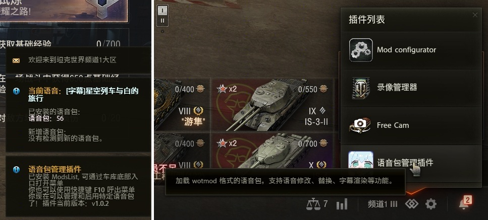
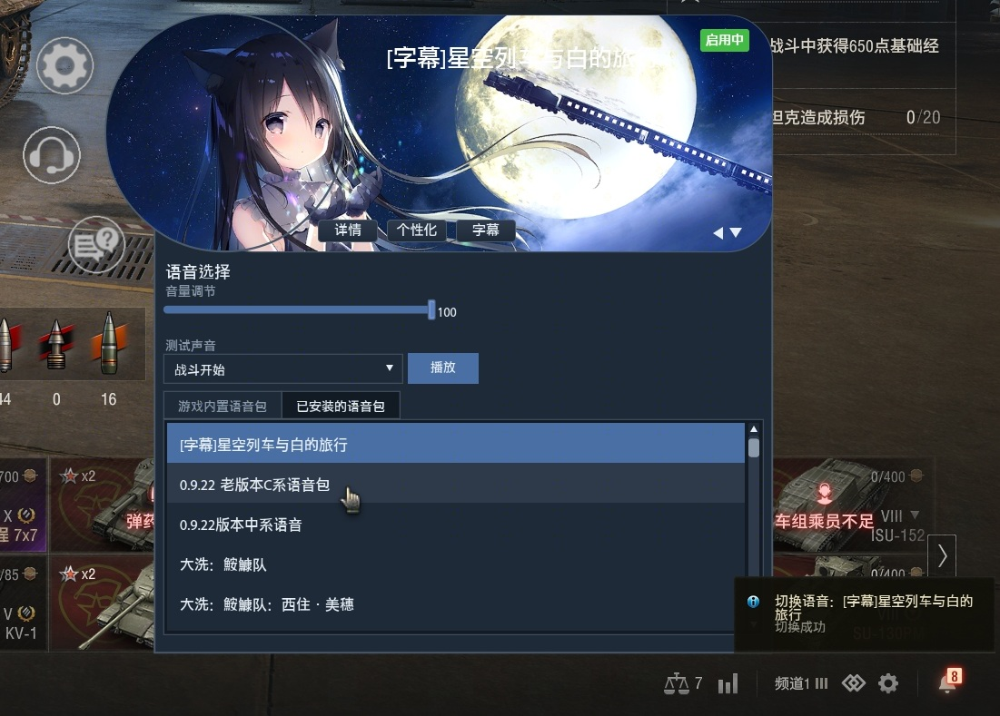
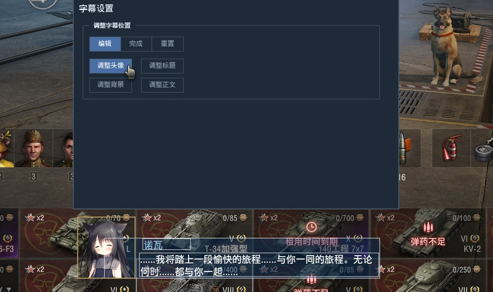
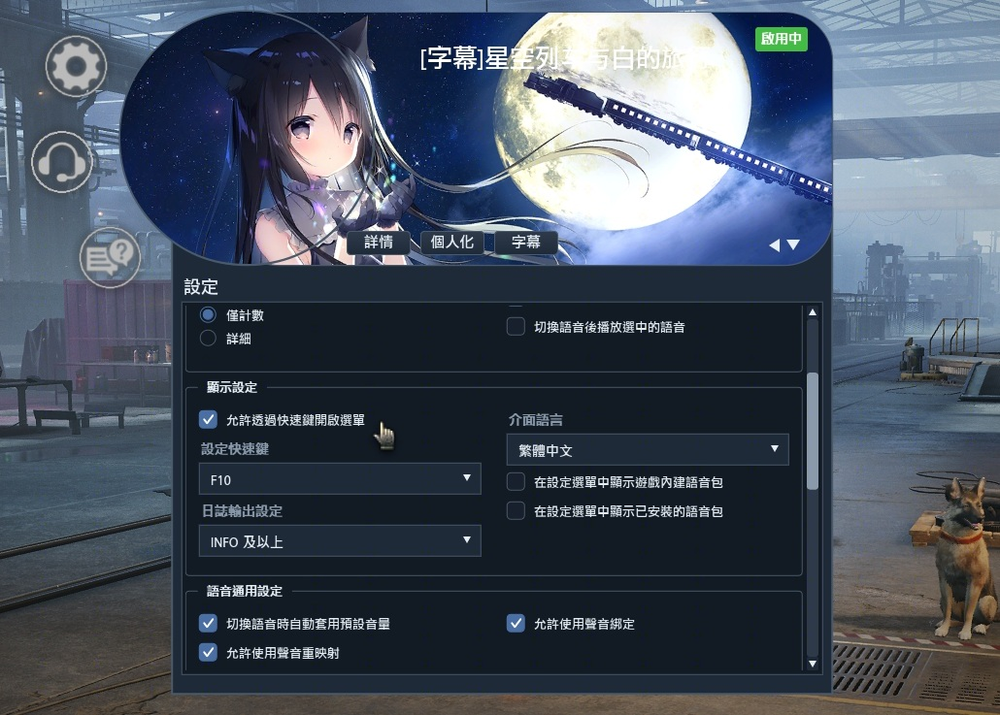

# 坦克世界语音包管理插件

**Language:** [English](README.en.md) | [简体中文](README.md)

## 简介

这是一个专注于《坦克世界》各种来源语音包之间的兼容与相互切换的 mod，
并为第三方语音包提供了更多语音修改功能，支持渲染自定义字幕。

它将语音包根据来源划分为“游戏内语音”和“已安装语音”，并根据你所在的客户端生成游戏内语音包列表。
它使用 [ModsList](https://github.com/wot-public-mods/mods-list) 作为菜单入口，
必要的时候，你也可以指定快捷键来打开 / 隐藏主菜单。插件界面语言当前支持简中、繁中、英文。
繁体中文目前为机翻，欢迎贡献翻译。

## 预览

语音包统计（左）与车库 ModsList 入口（右）

 

语音包切换以及插件背景与颜色切换效果

 

编辑字幕组件位置效果（点击后可激活拖拽）

 

繁体中文界面效果

## 功能介绍

### 针对游戏内置语音：

- 切换语音包时自动应用已保存的音量方案。
- 试听声音，事件播放列表保存在**配置文件夹**[^1]/`📂jsons`/`📃playEvent.json`，这些信息可以任你修改。
- 可以使用客户端中所有的语音包，包含系别语音，这个语音包列表将自动扩容。
- 系别语音可以切换成员性别；特殊语音可以使用特殊模式：切换车长/车组语音、使用其他语言版本。
- 游戏内语音包信息保存在**配置文件夹**/`📂jsons`/`📃gameSoundModes.json`，这些信息可以任你修改。
- 使语音包在设置菜单中可见，这里优先使用保存的名字，这里的语音选项顺序遵循 Python 2 的无序字典。

### 针对第三方语音包：

- 基础的自动切换音量、试听事件、语音可见。
- 支持字幕渲染，字幕引擎与官方 GUP Mod 差别较大。
- 第三方语音包信息保存在**配置文件夹**/`📂jsons`/`📃voiceover.json`，你仅能修改音量。
- 切换语音包时，可以选择播放语音包中的**选中语音**[^2]。
- 切换语音包时，可以选择一并切换界面背景和颜色。
- 切换语音包时，可以同时切换重映射方案与声音绑定方案，这两个声音修改功能可以被禁用。
- 语音包信息页可以渲染简单的 HTML，可以用于介绍语音包信息。

### 其他：

插件运行时部分文件会拷贝到磁盘，并优先从磁盘中读取，这意味着你可以对这些资源自由修改：

- 默认背景图：位于**配置文件夹**下的 `📂bgimgs` 和 `📂icons`。
- 界面本地化译文文件：位于**配置文件夹**/`📂l10n` 中。
- 热键字典：**配置文件夹**/`📂jsons`/`📃hotkey.json`。
- 内置颜色主题字典：**配置文件夹**/`📂jsons`/`📃theme.json`。
- 快捷消息文本 I18N Keys：**配置文件夹**/`📂jsons`/`📃ingameGuiText.json`。

为了实现声音绑定指令触发，对游戏内快捷消息文本做了拦截，那既然拦都拦了，干脆再整个消息替换功能吧。
既然都能替换快捷消息了，那点亮喊话也整一个吧。点亮喊话的文本你也可以自拟，不过要注意绕开屏蔽词。

### 运行时日志：

位于**配置文件夹**/`📃script.log`，中文日志。

## 编译、构建、安装与相关教程

### 编译 SWF：

使用 [FlashDevelop](https://flashdevelop.org/) 编译项目，需要安装 `Apache Flex SDK`，我使用的是 4.16.1，项目属性配置如下：

|项目属性|选项|内容|
| :-- | :-- | :-- |
| 输出 | 平台 | Flash Player，版本 11.0 |
| 输出 | 常规 | 帧率 50 fps |
| SDK | 选择SDK | Apache Flex SDK 4.16.1 |
| 类路径 | 项目类路径 | (1)`src`；(2)`..\acv_shared\src` |
| 编译器选项 | External Libraries | `..\..\lib\swc\base_app-1.0-SNAPSHOT.swc` `..\..\lib\swc\battle.swc` `..\..\lib\swc\common-1.0-SNAPSHOT.swc` `..\..\lib\swc\common_i18n_library-1.0-SNAPSHOT.swc` `..\..\lib\swc\gui_base-1.0-SNAPSHOT.swc` `..\..\lib\swc\gui_battle-1.0-SNAPSHOT.swc` `..\..\lib\swc\gui_lobby-1.0-SNAPSHOT.swc` `..\..\lib\swc\lobby.swc` |

分别编译项目 `acv_menu` 和 `acv_subtitle`，在 `resource/flash/` 下生成
`autoConfigVoiceOverMenu.swf` 和 `autoConfigVoiceOverSubtitle.swf`。

### 构建 WOTMOD：

使用 Python 2.7.18 构建，运行 `build.py`，在 build 文件夹生成 mod 文件。

### 安装：

将 mod 本体和 `modsListApi`放入 `<坦克世界安装目录>/mods/<当前版本号>/` 下即可。

### 教程：

- 了解 WOTMOD 文件：[《Mod 文件介绍》](./docs/Mod文件介绍.md)

- 从零开始打包语音包：[《语音包打包格式规范》](./docs/语音包打包格式规范.md)

- 从零开始制作字幕语音包：《字幕引擎使用指南》将于不久后发布。

---

### TODO

 - [x] 声音绑定触发功能实现
 - [x] 字幕渲染引擎
 - [x] L10N
 - [ ] 《字幕引擎使用指南》
 - [ ] 支持音效库的动态加载与管理

[^1]: <坦克世界安装目录>/mods/configs/autoConfigVoiceOver`
[^2]: 这是一个我自定义的 Wwise 事件“vo_selected”，你可以为其添加多条语音，在语音包被选中后播放
